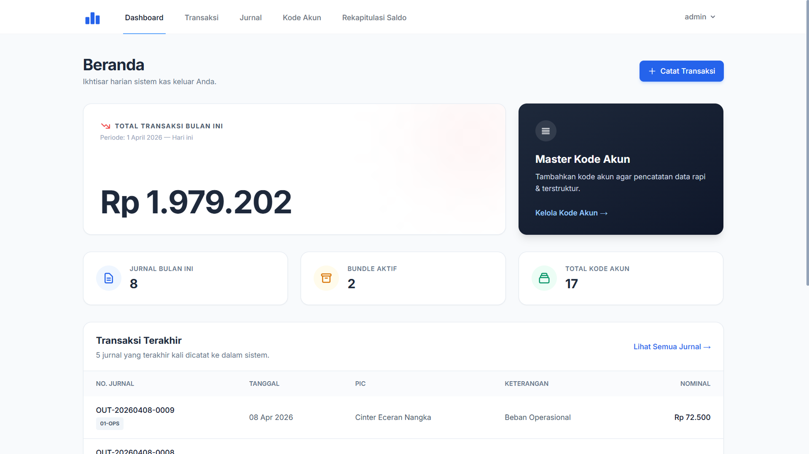
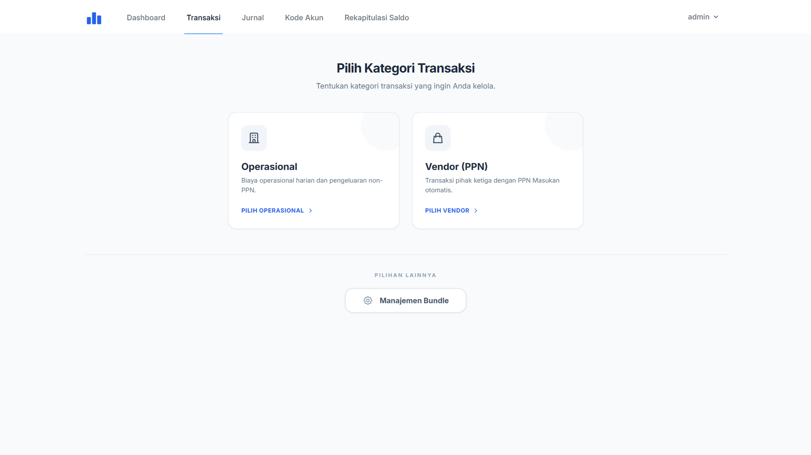
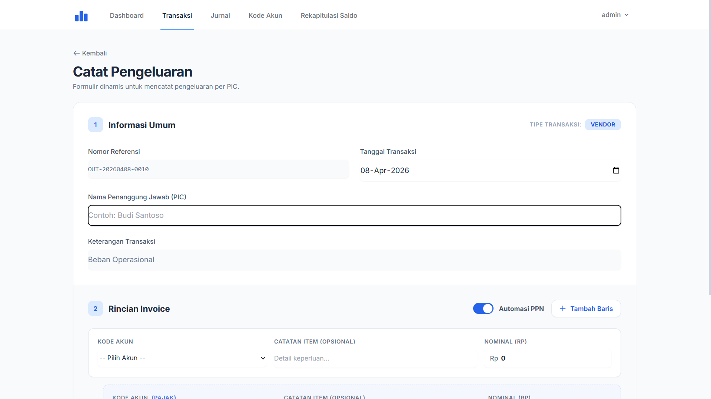
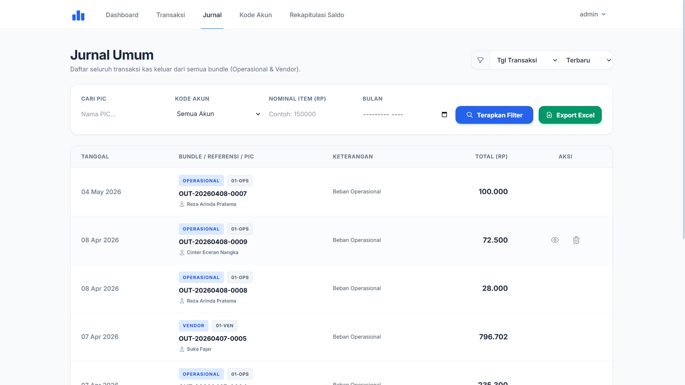

# 📊 Jurnal Accounting System

[](https://laravel.com)
[](https://www.php.net)
[](https://www.postgresql.org)
[](https://vercel.com)
[](https://opensource.org/licenses/MIT)

A lightweight yet powerful accounting system built with **Laravel 12**, **PostgreSQL (Supabase)**, and **Tailwind CSS**. Designed for simplicity and efficiency in managing financial journals, accounts, and reports.

---

## ✨ Key Features

- **📂 Account Management (COA)**: Create and manage your Chart of Accounts with ease.
- **📝 Journal Transactions**: Streamlined interface for recording debit and credit entries.
- **📦 Bundle System**: Organize transactions into "Bundles" (Operational or Vendor) with open/close lifecycle management.
- **🔍 Advanced Search**: Filter and find transactions quickly based on dates or accounts.
- **📊 Financial Reports**: Generate real-time **Trial Balance** reports to monitor financial health.
- **📥 Excel Export**: Export your journal entries directly to Excel for further analysis.
- **🚀 Cloud Ready**: Optimized for serverless deployment on **Vercel** and **Supabase**.

---

## 📸 Screenshots

<p align="center">
  
  <br><i>Dashboard Overview - Real-time financial monitoring.</i>
</p>

<p align="center">
  
  <br><i>Transaction Selection - Choose between Operational or Vendor categories.</i>
</p>

<p align="center">
  
  <br><i>Dynamic Forms - Add transactions with multiple line items and tax calculations.</i>
</p>

<p align="center">
  
  <br><i>General Journal - Comprehensive list of all financial entries with advanced filters.</i>
</p>

---

## 🛠️ Tech Stack

- **Backend**: [Laravel 12](https://laravel.com/) (PHP 8.2+)
- **Database**: [PostgreSQL](https://www.postgresql.org/) (via [Supabase](https://supabase.com/))
- **Frontend**: [Tailwind CSS](https://tailwindcss.com/) & [Alpine.js](https://alpinejs.dev/) (via Laravel Breeze)
- **Deployment**: [Vercel](https://vercel.com/)
- **Packages**:
  - `spatie/simple-excel` for Excel exports
  - `laravel/breeze` for authentication

---

## 🚀 Getting Started

### Prerequisites

- PHP 8.2 or higher
- Composer
- Node.js & NPM
- PostgreSQL database (Local or Supabase)

### Installation

1. **Clone the repository**
   ```bash
   git clone https://github.com/USERNAME/jurnal-accounting.git
   cd jurnal-accounting
   ```

2. **Install dependencies**
   ```bash
   composer install
   npm install && npm run build
   ```

3. **Environment Setup**
   ```bash
   cp .env.example .env
   php artisan key:generate
   ```

4. **Configure Database**
   Update your `.env` file with your PostgreSQL credentials (Supabase recommended):
   ```env
   DB_CONNECTION=pgsql
   DB_HOST=your-supabase-host
   DB_PORT=6543
   DB_DATABASE=postgres
   DB_USERNAME=your-username
   DB_PASSWORD=your-password
   ```

5. **Run Migrations**
   ```bash
   php artisan migrate
   ```

6. **Serve Locally**
   ```bash
   php artisan serve
   ```

---

## ☁️ Deployment (Vercel)

This project is pre-configured for Vercel deployment using `vercel.json` and a custom `api/index.php` entry point to handle the serverless environment.

1. **Push your code** to a GitHub repository.
2. **Import the project** in Vercel.
3. **Set Environment Variables** in Vercel dashboard (ensure `APP_KEY` and database credentials are set).
4. **Deploy!**

For more details, see [project_setup_guideline.md](file:///d:/Data/IT/Project/jurnal-accounting/project_setup_guideline.md).

---

## 🤝 Contributing

Contributions are welcome! Please feel free to submit a Pull Request.

---

<p align="center">
  Made with ❤️ by <a href="https://github.com/rezaarinda26">Reza Arinda</a>
</p>
